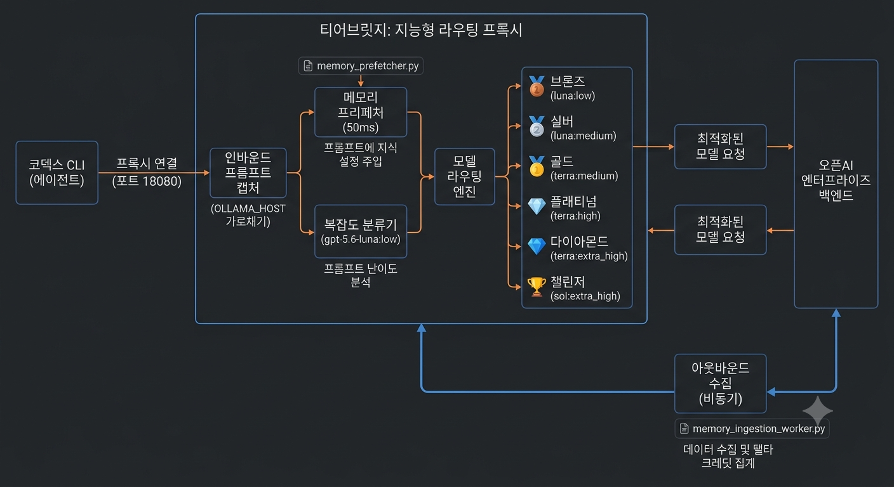
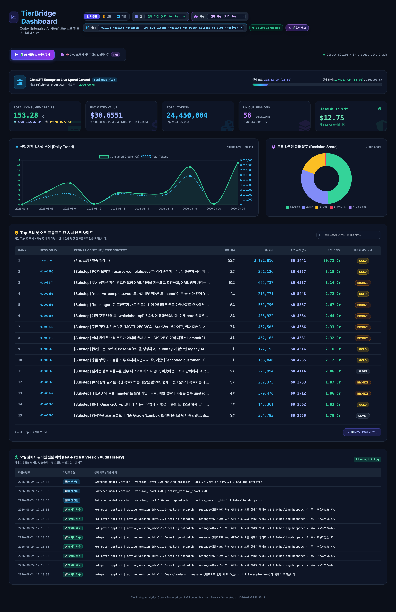
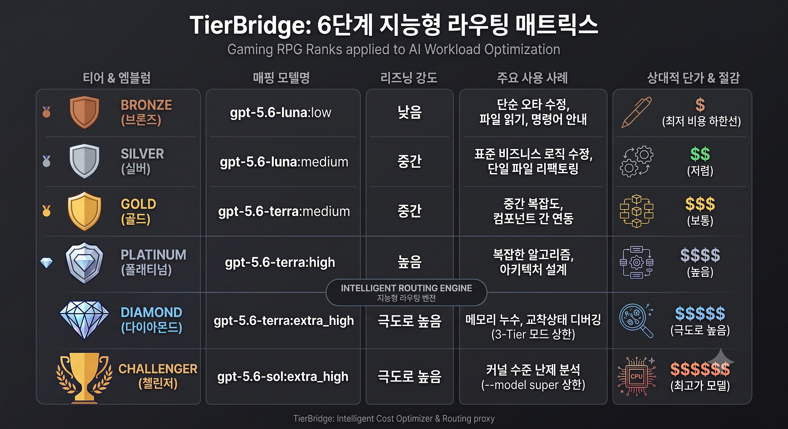
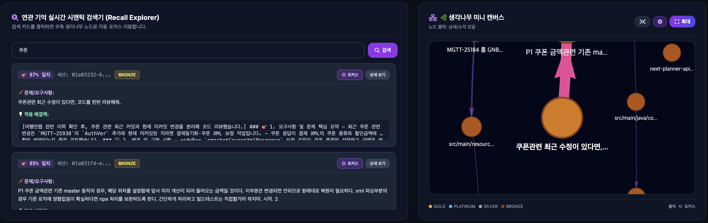
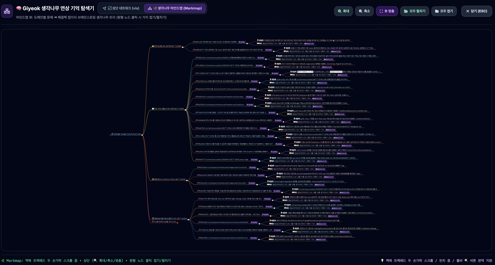
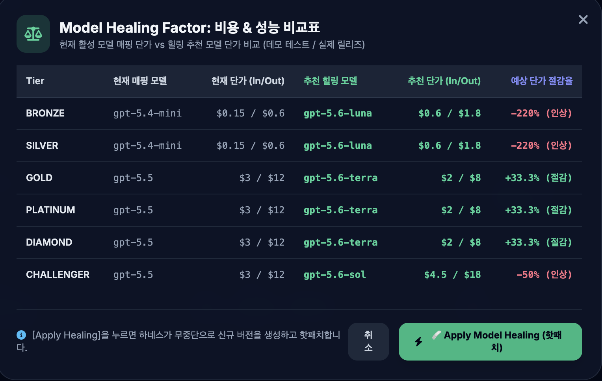

# ⚡ TierBridge

> **Codex & ChatGPT Enterprise 크레딧을 최대 70%까지 자동 절감하고, 개발 맥락을 스스로 학습하는 자가진화형 LLM 라우팅 하네스 프록시**

<p align="center">
  
</p>

TierBridge는 에이전트 CLI(Codex 등)와 OpenAI 백엔드 사이에서 동작하는 지능형 로컬 프록시입니다. 에이전트 코드 수정 없이 투명하게 동작하며, 질문의 복잡도를 실시간으로 평가하여 **최적의 모델과 추론 레벨(Reasoning Effort)을 6단계 게이밍 랭크 티어로 자동 스왑**해 크레딧을 대폭 절약하고, 이전 문제 해결 지식을 **생각나무(Thought-Tree) 장기 기억망**으로 보존합니다.

---

## 🚀 빠른 시작 (Getting Started: A to Z)

처음 사용하는 사용자도 아래 4단계를 따라하면 즉시 전체 기능을 활용할 수 있습니다.

### 1단계: 최초 1회 런타임 배포 (`./deploy.sh`)
개발 저장소에서 원클릭 배포 스크립트를 실행합니다. 배포가 완료되면 백그라운드 프록시가 가동되고 **글로벌 쉘 단축키(Alias)가 `~/.zshrc`에 자동 등록**됩니다:

```bash
./deploy.sh
```

> [!TIP]
> 배포와 동시에 현재 터미널에 환경 변수까지 한 번에 연결하고 싶다면 `source ./deploy.sh`로 실행하셔도 좋습니다.

---

### 2단계: 작업 터미널 세션 연결 (`tierbridge`)
새 터미널 창을 열거나 작업을 시작할 때, **어느 폴더에서든 `tierbridge` 한 줄만 입력**하면 현재 터미널 세션에 하네스 환경 변수(`OLLAMA_HOST=http://127.0.0.1:18080`)가 즉시 주입됩니다:

```bash
tierbridge
```

---

### 3단계: 에이전트 CLI 실행
평소 사용하시던 Codex CLI를 그대로 실행하시면 스마트 라우터와 생각나무 기억 저장소가 투명하게 작동합니다:

```bash
# [기본 모드] Standard 3-Tier 라우터 (BRONZE ~ DIAMOND 캡핑)
codex --oss --local-provider=ollama

# [고난도 모드] 4-Tier Sol 라우터 (최상위 CHALLENGER / gpt-5.6-sol 확장)
codex --oss --local-provider=ollama --model super
```

> [!TIP]
> **🔑 로그인 인증은 기존 Codex 계정과 100% 동일하게 자동 연동됩니다**  
> 별도의 신규 회원가입이나 복잡한 API Key 발급/환경설정 과정이 전혀 필요 없습니다. 평소 사용하시던 Codex CLI에 이미 한 번이라도 로그인되어 있다면(`~/.codex/auth.json`), TierBridge 프록시가 기존 ChatGPT Enterprise 인증 세션을 자동으로 승계하여 안전하고 투명하게 통신합니다.

> [!NOTE]
> **💡 왜 공급자를 `ollama`로 지정해야 하나요?**  
> Codex CLI 바이너리가 지원하는 로컬 오픈소스 공급자 옵션은 `ollama`로 고정되어 있습니다. TierBridge는 에이전트 코드 수정 없이 `OLLAMA_HOST` 환경변수로 요청을 가로채어 작동하므로, `--local-provider=ollama`를 사용해야만 하네스 프록시의 스마트 라우팅 및 크레딧 절감 기능을 정상적으로 연결받을 수 있습니다.

---

### 4단계: 실시간 대시보드 및 로그 모니터링
작업 중 소모된 토큰, 절감된 크레딧, 생성 코드 줄 수(LOC), 생각나무 지식 그래프 및 로그를 전용 단축키로 손쉽게 확인합니다:

```bash
# 📊 Kibana 스타일 3초 실시간 라이브 대시보드 열기 (브라우저 자동 오픈)
tierbridge-dash

# 📄 실시간 런타임 라우팅 로그 모니터링 (tail -f)
tierbridge-log

# 💳 ChatGPT Enterprise 실제 계정 잔여 크레딧 및 한도 조회
tierbridge-credit
```

<p align="center">
  
</p>

---

## 🎮 주요 핵심 기능 (Core Features)

### 1. 🎯 6단계 게이밍 RPG 랭크 티어 동적 라우팅
질문의 난이도, 변경 파일 범위, AST 복잡도를 실시간으로 판정하여 적합한 모델과 추론 강도로 자동 연결합니다:

<p align="center">
  
</p>

* 🥉 **BRONZE** (`gpt-5.6-luna:low`): 단순 오타 수정, 명령어 안내, 파일 읽기/조회 스텝
* 🥈 **SILVER** (`gpt-5.6-luna:medium`): 표준 비즈니스 로직 단위 구현, 단일 파일 리팩토링
* 🥇 **GOLD** (`gpt-5.6-terra:medium`): 중간 복잡도 기능 구현, 컴포넌트 간 연동
* 💎 **PLATINUM** (`gpt-5.6-terra:high`): 복잡한 알고리즘, 다중 컴포넌트 아키텍처 설계
* 🔷 **DIAMOND** (`gpt-5.6-terra:extra_high`): 심층 디버깅 및 성능 튜닝 (3-Tier 모드 상한)
* 🏆 **CHALLENGER** (`gpt-5.6-sol:extra_high`): 데드락/메모리 누수 분석 (`--model super` 모드 상한)

> 📖 **[상세 기술 문서: 라우팅 하네스 & 6단계 랭크 설계 (routing_harness.md)](docs/model/routing_harness.md)**

---

### 2. 🧠 생각나무 장기 기억 저장소 (Giyeok Thought-Tree & Memory System)

> **💡 왜 '생각나무 기억저장소'가 TierBridge의 핵심 심장인가?**  
> 일반적인 AI 코딩 에이전트는 세션이 종료되면 모든 작업 맥락을 잊어버리는 **"기억상실증(Amnesia)"**을 겪습니다. 이로 인해 동일한 도메인 규칙(예: 쿠폰 계산, Redis 캐시 키 정책, XML 파싱 NPE 방어)을 만날 때마다 매번 수십 번의 파일 탐색(grep)과 시행착오 턴을 반복하며 대량의 토큰과 크레딧을 낭비합니다.  
> TierBridge의 생각나무 기억저장소는 이 문제를 해결하는 **4대 핵심 전략적 역할**을 수행합니다:
> 
> 1. 🛡️ **초고속 회상 기반 탐색 턴 80% 제거 (Pre-fetch Recall)**: 신규 질문 인입 시 50ms 이내로 과거 검증된 정답 해결책을 선행 주입하여, 불필요한 파일 탐색과 중간 추론 과정을 건너뛰고 정답으로 직행합니다.
> 2. 💰 **모델 랭크 다운스케일링 시너지 (Tier Downscaling)**: 정답 힌트가 이미 주입되어 있으므로 고비용 모델(`GOLD`/`DIAMOND`) 대신 저비용 랭크(`BRONZE`/`SILVER`) 모델만으로도 완벽한 코드가 생성되어 크레딧 절감 효과가 극대화됩니다.
> 3. 🌿 **자가진화형 지식 자산화 (Self-Evolving Knowledge Graph)**: 문제를 해결할 때마다 지식 간 연상 엣지 가중치(`+0.1x` ~ `3.0x`)가 강화되어, 조직과 개발자의 노하우가 유기적인 '생각나무'로 영구 축적됩니다.
> 4. ⚡ **기억 오염 원천 차단 (Neuralizer Safety)**: 기획이 변경되었거나 무효화된 과거 지식은 원클릭(0ms)으로 뇌세포를 지우듯 정밀 소각하여 모델의 환각(Hallucination)을 방지합니다.

```
[ TierBridge 기억 저장소 파이프라인 ]
  1. 자동 수집 (Ingestion)      : 에피소드 종료 시 문제-해결-LOC 구조화 자동 적재
  2. 사전 회수 (Pre-fetch Recall): 신규 질문 인입 시 50ms 샌드박스 시맨틱 유사도 검색 & 투명 주입
  3. 시너지 강화 (Reinforcement) : 연관 지식 재참조 시 엣지 가중치 강화 (+0.1x ~ 최대 3.0x 승격)
  4. 시각화 & 정밀 소각 (Vis/Wipe): 2단 분할 시맨틱 검색창 & 듀얼 뷰포트 탐색기 & Neuralizer
```

#### 🔍 2단 분할 시맨틱 실시간 검색 UI & 미니 캔버스
* **좌측 검색 패널**: 키워드 입력 시 150ms 디바운스로 일치율(Match Score) 높은 기억을 실시간 카드로 렌더링 (검색어 미입력 시 상위 핵심 지식 열매 추천).
* **우측 콤팩트 미니 그래프**: 자주 연결된 핵심 지식들이 유기적으로 성단을 형성하며, 카드 클릭 시 카메라가 즉시 1.5배 줌인 포커스 이동.

<p align="center">
  
</p>

#### 🌌🌿 전체화면 듀얼 뷰포트 (Dual Viewport)
* **🌌 성단 네트워크 뷰 (`vis-network`)**: 물리 엔진 기반으로 가중치가 높은 핵심 허브와 연관 성단을 직관적으로 조망.
* **🌿 생각나무 마인드맵 뷰 (`Markmap`)**: 도메인별(쿠폰, GNB 가이드, 여행네컷 등)로 지식을 Root ➔ Branch ➔ Leaf 접이식 브레인스토밍 트리로 펼쳐보며 문제와 해결책을 신속히 정독 (맥북 트랙패드 두 손가락 스크롤 줌 및 노드별 `[🔍 상세 확인]` 링크 완비).

<p align="center">
  
</p>

#### ⚡ Neuralizer (기억 정밀 소각)
* 잘못되거나 더 이상 유효하지 않은 지식을 클릭 한 번으로 **0ms 즉시 캔버스에서 소각**하고 DB(노드, 엣지, 메모리 테이블)에서 완전 영구 삭제.

> 📖 **[상세 기술 문서: 듀얼 뷰포트 마인드맵 생각나무 명세서 (dashboard_dual_viewport_markmap_tree.md)](docs/memory/dashboard_dual_viewport_markmap_tree.md)**  
> 📖 **[상세 기술 문서: 기억 저장소 대시보드 연동 명세서 (dashboard_memory_integration.md)](docs/memory/dashboard_memory_integration.md)**  
> 📖 **[상세 기술 문서: 뉴럴라이저 & 콤팩트 그래프 명세서 (dashboard_neuralizer_and_compact_graph.md)](docs/memory/dashboard_neuralizer_and_compact_graph.md)**

---

### 3. 🩹 Model Healing Factor & 무중단 핫패치
OpenAI / ChatGPT Enterprise 백엔드에 신규 모델이 출시되거나 단가 인하 패치가 이루어지면 자동으로 감지하여 원클릭으로 반영합니다.

<p align="center">
  
</p>

* **신규 모델 자동 감지 배너**: 대시보드 상단에 `[ 🩹 최신 모델 핫패치 가능 (GPT-5.6 Lineup) ]` 알림 자동 트리거
* **단가 & 절감율 대조표**: 현재 활성 모델 매핑 vs 추천 고효율 모델 단가 및 예상 절감율(예: 40% 절감) 실시간 계산
* **원클릭 무중단 핫패치 (`POST /v1/models/heal`)**: 서버 재부팅 없이 `v1.1.0-healing-hotpatch`로 즉시 스위칭
* **원클릭 롤백 스위칭 (`POST /v1/models/version/switch`)**: 대시보드 드롭다운에서 이전 안정 버전(`v1.0.0`)으로 1초 만에 복원

> 📖 **[상세 기술 문서: Model Healing Factor & 버전 관리 스펙 (model_healing_factor.md)](docs/model/model_healing_factor.md)**

---

### 4. 📊 사용량 분석 & 실시간 웹 대시보드 (`analyze_usage.py`)
`harness.log`에 기록된 데이터를 정밀 분석하여 일자별, 월별, 세션별 통계와 3초 라이브 갱신 대시보드를 제공합니다.

```bash
# 전체 통계 및 Top 크레딧 소모 프롬프트 요약 보고서 출력
./analyze_usage.py

# 특정 월(YYYY-MM) 단위 필터링
./analyze_usage.py --month 2026-08

# 특정 세션 ID 전용 필터링
./analyze_usage.py --session 5eb61a1e

# 3초 라이브 자동 갱신 웹 대시보드 생성 및 열기
./analyze_usage.py --html
```

* **🎨 3-Segment 테마 스위처**: `어두운 (Dark)` / `밝은 (Light)` / `시스템 기본 (System OS)` 원클릭 테마 전환.
* **3초 라이브 오토싱크 (`#liveSyncBadge`)**: 브라우저를 열어두기만 해도 새 로그와 수치가 실시간 갱신됩니다.
* **크레딧 정밀 3분할 집계**: `전체 크레딧`, `메인 모델 크레딧`, `분류기 크레딧`을 분리 표시합니다.
* **생성 소스코드(LOC) 집계**: 모델 답변 내 마크다운 코드 블록 줄 수를 추출하여 개발 생산성을 측정합니다.

> 📖 **[상세 기술 문서: 대시보드 UI 테마 가이드라인 (dashboard_ui_theme_guideline.md)](docs/dashboard/dashboard_ui_theme_guideline.md)**  
> 📖 **[엔지니어링 명세서: 사용량 분석 & 대시보드 기술 명세 (analyze_usage.md)](docs/dashboard/analyze_usage.md)**  
> 📖 **[설계서: LOC 코드 라인 추출 및 생산성 지표 설계 (loc_tracker.md)](docs/dashboard/loc_tracker.md)**

---

## ⌨️ 글로벌 단축키 & 명령어 가이드 (Shell Aliases)

`./deploy.sh` 실행 시 사용자의 `~/.zshrc`에 자동 등록되어 터미널 어디에서든 즉시 사용할 수 있습니다:

| 명령어 (Alias) | 설명 및 동작 |
| :--- | :--- |
| **`tierbridge`** | 하네스 프록시 런타임 실행 여부를 점검하고, 현재 터미널 세션에 환경 변수 주입 |
| **`tierbridge-dash`** | Kibana 스타일 3초 라이브 웹 대시보드(`usage_dashboard.html`)를 생성하고 브라우저로 오픈 |
| **`tierbridge-log`** | 라이브 프록시 가동 로그를 실시간으로 스트리밍 모니터링 (`tail -f ~/.tierbridge/live/harness.log`) |
| **`tierbridge-credit`** | ChatGPT Enterprise 실제 계정 잔여 크레딧 및 지출 한도 실시간 조회 |

---

## 🛠️ 트러블슈팅 & FAQ (Troubleshooting)

* **Q1. 새 터미널 창을 열면 프록시 연결이 안 됩니다.**
  * ➔ 새 터미널에서 `tierbridge`를 1회 입력하여 환경 변수를 활성화하세요.
* **Q2. 포트 18080에 프로세스가 2개 뜹니다.**
  * ➔ FastAPI Uvicorn Reloader(Watcher + Worker)의 정상적인 아키텍처입니다.
* **Q3. 핫패치 적용 후 이전 버전으로 되돌리고 싶습니다.**
  * ➔ 대시보드 상단의 **[버전 선택 드롭다운]**에서 `Standard Baseline v1.0.0`을 선택하면 1초 만에 롤백됩니다.
* **Q4. 기억 저장소의 노드를 지우고 싶습니다.**
  * ➔ 대시보드의 기억 카드 또는 그래프 노드 상세 모달에서 **[⚡ 소각하기 (Neuralize)]** 버튼을 누르면 캔버스와 DB에서 즉시 영구 삭제됩니다.

> 📖 **[트러블슈팅 QA 전체 가이드 (troubleshooting_QA.md)](docs/operations/troubleshooting_QA.md)**

---

## 📑 전체 기술 문서 허브 (Complete Documentation Index)

| 카테고리 | 문서명 | 설명 |
| :--- | :--- | :--- |
| **기억 저장소 & 듀얼 뷰포트 (`docs/memory/`)** | [dashboard_dual_viewport_markmap_tree.md](docs/memory/dashboard_dual_viewport_markmap_tree.md) | 성단 네트워크 ↔ 접이식 마인드맵 듀얼 뷰포트 명세 |
| | [dashboard_memory_integration.md](docs/memory/dashboard_memory_integration.md) | 2단 분할 시맨틱 검색 & 실시간 기억 카드 연동 명세 |
| | [dashboard_neuralizer_and_compact_graph.md](docs/memory/dashboard_neuralizer_and_compact_graph.md) | 콤팩트 미니 그래프 & Neuralizer 정밀 소각 설계 |
| **대시보드 & 분석 (`docs/dashboard/`)** | [analyze_usage_guide.md](docs/dashboard/analyze_usage_guide.md) | CLI 사용량 분석 가이드 및 활용법 |
| | [analyze_usage.md](docs/dashboard/analyze_usage.md) | 사용량 분석 & 대시보드 아키텍처 명세서 |
| | [dashboard_ui_theme_guideline.md](docs/dashboard/dashboard_ui_theme_guideline.md) | Dark / Light / System 3단 테마 시스템 가이드라인 |
| | [loc_tracker.md](docs/dashboard/loc_tracker.md) | 소스코드 LOC 추출 및 생산성 지표 설계서 |
| **모델 관리 & 라우팅 (`docs/model/`)** | [routing_harness.md](docs/model/routing_harness.md) | 6단계 랭크 티어 라우팅 및 분류기 명세서 |
| | [model_healing_factor.md](docs/model/model_healing_factor.md) | 자가치유 핫패칭 및 버전 스냅샷 롤백 엔진 규격 |
| | [delta_credit_interceptor.md](docs/model/delta_credit_interceptor.md) | 델타 크레딧 & 실시간 계정 잔여량 인터셉터 설계 |
| | [standard_report_directive.md](docs/model/standard_report_directive.md) | 3단 마크다운 보고서 표준 출력 투명 주입 규격 |
| **배포 및 운영 (`docs/operations/`)** | [deployment_architecture.md](docs/operations/deployment_architecture.md) | 런타임 격리 배포 아키텍처 및 환경변수 설정 가이드 |
| | [troubleshooting_QA.md](docs/operations/troubleshooting_QA.md) | 트러블슈팅 및 문제해결 QA 전체 가이드 |
| **결과 보고서 & 지표 (`docs/reports/`)** | [RESULT_REPORT.md](docs/reports/RESULT_REPORT.md) | 최종 하네스 엔지니어링 종합 결과 보고서 |
| | [ROI_검토_지표.md](docs/reports/ROI_검토_지표.md) | 재정적 절감액 및 ROI 핵심 성과 지표 |
| **예비 기술 명세서 / RFC (`docs/rfc/`)** | [preliminary_remote_db_extension_spec.md](docs/rfc/preliminary_remote_db_extension_spec.md) | 🌐 원격 DB 확장 및 전사 동기화 예비 기술 명세서 (RFC) |

> 📦 **과거 단계별 개발 지시서 및 중간 검증 보고서**: [docs/archive/](docs/archive/) 디렉토리에 히스토리용으로 안전하게 아카이브 보존되어 있습니다.

